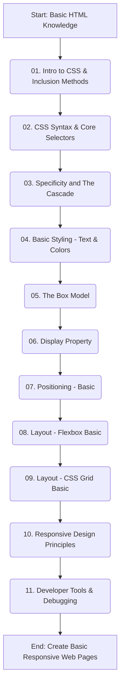

# CSS Foundations Learning Module Examples

This repository provides a hands-on, runnable collection of code examples for a foundational learning module on the Basics of CSS (Cascading Style Sheets). It's designed for web development beginners to understand fundamental styling concepts, layout techniques, and debugging common issues.

## Overview

The module progresses through core CSS concepts, from basic syntax and selectors to responsive design and developer tools. Each numbered directory (`src/01-intro-inclusion`, `src/02-syntax-selectors`, etc.) contains minimal HTML and CSS files that you can open directly in your browser to see the concepts in action.

## Architecture/Learning Flow



## Concepts Covered

This module covers the following foundational CSS topics, with practical examples for each:

1.  **Introduction to CSS**: What it is, how it works with HTML, and different ways to include CSS (inline, internal, external stylesheets – with emphasis on external as best practice).
2.  **CSS Syntax & Core Selectors**: Declarations, rule sets, type, class, ID selectors, and basic grouping.
3.  **Specificity and The Cascade**: Understanding how CSS rules are applied, specificity calculation, inheritance, and cautious use of `!important`.
4.  **Basic Styling Properties**: `font-family`, `font-size`, `font-weight`, `color`, `text-align`, `line-height`, `background-color`, `background-image`.
5.  **The Box Model**: `margin`, `border`, `padding`, `content`, and the importance of `box-sizing: border-box`.
6.  **Display Property**: `block`, `inline`, `inline-block`, `none`.
7.  **Positioning (Basic)**: `static`, `relative`, `absolute`, `fixed`, `sticky`.
8.  **Layout Fundamentals - Flexbox (Basic)**: `display: flex`, `flex-direction`, `justify-content`, `align-items`.
9.  **Layout Fundamentals - CSS Grid (Basic)**: `display: grid`, `grid-template-columns`, `grid-template-rows`.
10. **Responsive Design Principles**: Viewport meta tag and basic media queries (`@media`).
11. **Developer Tools**: Inspecting, understanding, and debugging CSS using browser developer tools.

## How to Run the Examples

1.  **Clone the repository:**
    ```bash
    git clone https://github.com/aastom/css-foundations-module-examples.git
    cd css-foundations-module-examples
    ```
2.  **Navigate to an example:**
    Each concept has its own directory within the `src/` folder (e.g., `src/01-intro-inclusion`).
3.  **Open `index.html`:**
    Simply open the `index.html` file of the desired example directory in your web browser. There's no need for a local server or build tools.
    For instance, to view the first example, open `css-foundations-module-examples/src/01-intro-inclusion/index.html` in your browser.

## References

*   [MDN Web Docs - CSS](https://developer.mozilla.org/en-US/docs/Web/CSS)
*   [W3C CSS Current Work](https://www.w3.org/Style/CSS/current-work)
*   [A Complete Guide to Flexbox](https://css-tricks.com/snippets/css/a-guide-to-flexbox/)
*   [A Complete Guide to CSS Grid](https://css-tricks.com/snippets/css/a-guide-to-css-grid/)
*   [Specificity Calculator](https://specificity.keegan.st/)
