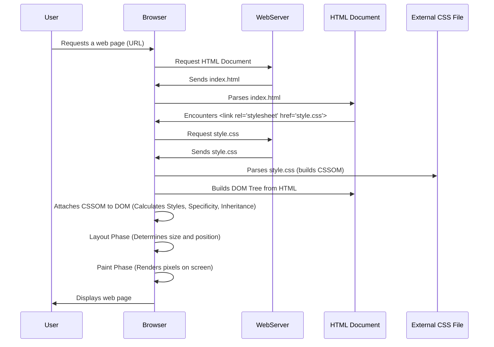

# Module Architecture and Learning Design

This document details the architectural decisions and the pedagogical approach behind the CSS Foundations Learning Module. The primary goal is to provide a zero-friction, hands-on learning experience for beginners, focusing on practical application and progressive complexity.

## Core Principles

*   **Progressive Learning**: Concepts are introduced in a logical order, building upon previously learned material. Critical concepts like specificity are introduced early to prevent common beginner frustrations.
*   **Hands-on Application**: Every theoretical concept is immediately followed by a runnable code example, allowing learners to experiment and see instant results.
*   **Simplicity**: Examples are minimal, focusing solely on the concept being taught. No build tools, no servers – just opening HTML files in a browser.
*   **Best Practices**: While demonstrating various methods (e.g., inline CSS), the module consistently guides learners towards industry best practices (e.g., external stylesheets, `box-sizing: border-box`).
*   **Debugging Empowerment**: Early introduction to browser developer tools equips learners with essential self-sufficiency.

## Repository Structure

The `src/` directory is organized into numbered subdirectories, each corresponding to a specific learning step. This structure reinforces the progressive learning path.

```
css-foundations-module-examples/
├── src/
│   ├── 01-intro-inclusion/             // Introduction to CSS, inclusion methods
│   │   ├── index.html
│   │   └── style.css
│   ├── 02-syntax-selectors/            // CSS syntax, type, class, ID selectors
│   │   ├── index.html
│   │   └── style.css
│   ├── 03-specificity-cascade/         // Specificity, cascade, inheritance
│   │   ├── index.html
│   │   └── style.css
│   ├── 04-text-colors-backgrounds/     // Basic styling: text, colors, backgrounds
│   │   ├── index.html
│   │   └── style.css
│   ├── 05-box-model/                   // The CSS Box Model
│   │   ├── index.html
│   │   └── style.css
│   ├── 06-display-property/            // Block, inline, inline-block, none
│   │   ├── index.html
│   │   └── style.css
│   ├── 07-positioning/                 // Static, relative, absolute, fixed, sticky
│   │   ├── index.html
│   │   └── style.css
│   ├── 08-flexbox-basic/               // Basic Flexbox for 1D layouts
│   │   ├── index.html
│   │   └── style.css
│   ├── 09-grid-basic/                  // Basic CSS Grid for 2D layouts
│   │   ├── index.html
│   │   └── style.css
│   ├── 10-responsive-design/           // Media queries, viewport meta tag
│   │   ├── index.html
│   │   └── style.css
│   ├── 11-dev-tools-debug/             // Using browser dev tools for debugging
│   │   ├── index.html
│   │   └── style.css
├── README.md                           // Main project overview and instructions
├── LICENSE
└── .gitignore
```

## How the Browser Renders CSS (Simplified Sequence)

This diagram illustrates a simplified sequence of how a web browser processes and applies CSS from an external stylesheet linked in an HTML document.



## Technical Constraints Revisited

*   **No Build Process**: Deliberately avoided to lower the barrier to entry for beginners. All examples are self-contained and run directly in a browser.
*   **Pure HTML/CSS**: No JavaScript for styling, no preprocessors, no frameworks. This ensures a laser focus on foundational CSS.
*   **Modern Browser Focus**: Examples are built with modern CSS standards, compatible with the latest versions of Chrome, Firefox, Safari, and Edge.
